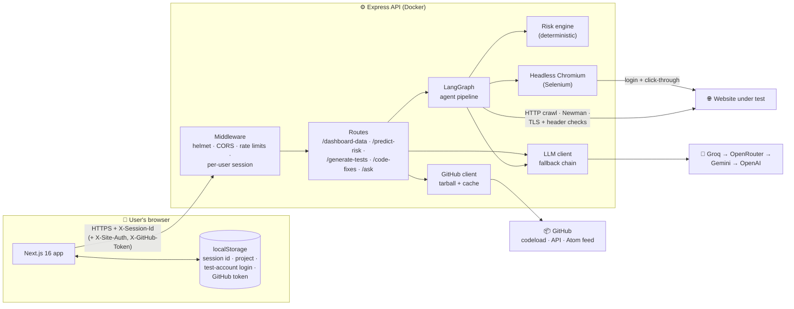
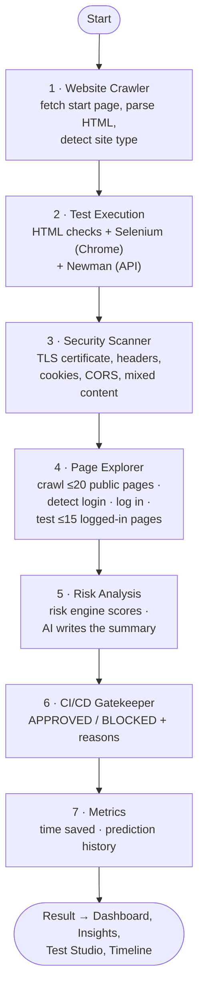
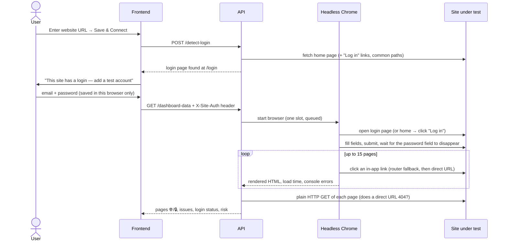

# 🤖 AI Tester Agent — Autonomous Release Intelligence

> Point it at a website (and optionally its GitHub repo). A pipeline of agents crawls the site, logs in with a test account, runs real browser, API and security tests, scores release risk with a transparent formula, and tells you whether the release should ship — and what to fix first.


---

## 🎯 What It Does

| Feature | What happens |
|---|---|
| 🧪 **Real test execution** | Functional, SEO, accessibility and performance checks on the crawled HTML, **Selenium** in headless Chrome, **Newman** API requests, and a built-in security scanner (TLS certificate, security headers, cookies, CORS, mixed content, open redirects). |
| 🗺️ **Multi-page crawl** | Follows same-site links to test up to **20 public pages**. |
| 🔐 **Logged-in testing** | Detects the login page, asks for a **test account**, logs in with a real browser, and tests up to **15 pages behind the login** — clicking through the app like a user, so single-page apps work too. |
| 📊 **Release risk score** | One deterministic formula weighted toward what breaks releases: **Functionality 35 · Security 30 · Performance 15 · Accessibility 10 · SEO 10**. |
| 🚦 **Deployment gate** | BLOCKED only for real release blockers (site down, broken pages, 404 on direct URLs, HTTPS problems) or high functionality/security risk — never for SEO alone. Also runs in GitHub Actions. |
| 🛠️ **Code Intelligence** | Downloads the GitHub repo, maps failing tests to source files, and suggests line-level fixes. |
| 💬 **Ask AI** | Answers questions about the codebase with file references. |
| 📈 **Run-to-run comparison** | Shows whether risk went up or down since the last run and exactly which checks changed. |

AI is optional: without an API key everything runs in **rule-based mode**. With keys, the AI writes explanations, fix suggestions and extra test ideas — it never sets the score.

---

## 🏗️ Architecture

### System overview



### The agent pipeline

Every dashboard run executes this LangGraph state graph. Each node reads the shared state and adds its results; the Timeline page shows each step.



### Logged-in testing flow



The password is request-scoped: it lives in the user's browser, is sent only with test runs, and is never stored, logged, or sent to the AI. After logging in the crawler only follows links — it never clicks buttons or submits forms — and skips anything that looks destructive (logout, delete, cancel…).

### Risk formula

Implemented once in [`backend/src/services/riskEngine.js`](backend/src/services/riskEngine.js) and used by every page, so results agree and re-runs are stable.

1. **Classify** each check by what it tests (not the runner's label) into Functionality, Security, Performance, Accessibility or SEO. Checks repeated by several runners (e.g. CSP, HSTS, mixed content) count **once**.
2. **Category risk** = severity-weighted share of failing checks (critical 5 · high 3 · medium 2 · low 1), 0–100.
3. **Overall risk** = weighted average: **Functionality 35%, Security 30%, Performance 15%, Accessibility 10%, SEO 10%**.
4. **Decision — BLOCKED** if any release blocker fails, **or** Functionality ≥ 50, **or** Security ≥ 60, **or** overall ≥ 60. Otherwise APPROVED.

| Release blockers |
|---|
| Start page doesn't load · pages fail to load · pages 404 when opened directly (refresh/bookmarks break) · page doesn't load in a real browser · HTTPS missing or certificate invalid · mixed content · any *critical* functionality or security check |

### Multi-user safety

| Concern | How it's handled |
|---|---|
| Users seeing each other's data | Every request carries an `X-Session-Id`; all project state, results and history live in a per-session store (in memory, idle sessions expire). |
| SSRF (pointing the server at internal networks) | Every URL — including redirects and crawled links — is resolved and rejected if it's private/loopback/link-local. |
| Abuse / cost | IP rate limits on all routes and stricter ones on pipeline runs; one headless Chrome at a time with a queue. |
| Secrets | Test-account logins and GitHub tokens stay in the user's browser and are sent per request; server-side keys only in environment variables. |
| GitHub rate limits | Public repo code comes from `codeload.github.com` as one tarball (no API quota), cached 15 min; commit/language fallbacks when the API is limited; a rejected server token is dropped instead of breaking every user. |
| AI outages | Provider/model fallback chain with cooldowns; if everything is down, rule-based analysis takes over. |

---

## 🧰 Tech Stack

| Layer | Technology |
|---|---|
| **Frontend** | Next.js 16 (App Router), React 19, Tailwind CSS v4, Zustand |
| **Backend** | Node.js 22, Express, helmet, express-rate-limit |
| **Orchestration** | LangGraph (`@langchain/langgraph`) |
| **Test runners** | Selenium WebDriver + Chromium, Postman/Newman, cheerio HTML analysis, built-in TLS/header security scanner |
| **AI** | Any OpenAI-compatible API — Groq, OpenRouter, Gemini, OpenAI, Ollama, custom |
| **CI/CD** | GitHub Actions: lint → tests → Docker build → frontend build → risk gate → deploy |

---

## 🚀 Run Locally

**Prerequisites:** Node.js 20+, Google Chrome (for Selenium and logged-in testing). An AI key is optional.

```bash
# 1. Backend  → http://localhost:5000  (health: /api/health)
cd backend
npm install
cp .env.example .env        # add any AI keys you have; set ALLOW_PRIVATE_URLS=true to test localhost sites
npm run dev

# 2. Frontend → http://localhost:3000
cd frontend
npm install
cp .env.example .env.local  # NEXT_PUBLIC_API_URL=http://localhost:5000/api
npm run dev
```

In development the API accepts requests from any `localhost` port, so it doesn't matter which port Next.js picks.

---

## 📊 Pages

| Page | What you see |
|---|---|
| **Dashboard** | Deployment decision with reasons, risk score, weighted category breakdown, pages tested (🌐 public / 🔒 logged-in), change since last run, project & login settings |
| **Test Studio** | Every executed check with expected vs. actual, plus AI-suggested test cases; export |
| **Insights** | Risk trend, category drill-down, required actions and prioritized recommendations |
| **Code Intelligence** | Failing tests mapped to repo files with line-level fix suggestions and projected risk |
| **Ask AI** | Chat about the codebase with file references |
| **Timeline** | Each agent's step, duration and result |

---

## 🔗 API

| Method | Endpoint | Description |
|---|---|---|
| `POST` | `/api/configure-project` | Set project name, website URL, GitHub repo |
| `GET` | `/api/project-info` | Current project settings |
| `POST` | `/api/detect-login` | Does the site have a login page? |
| `GET` | `/api/github-repo` | Repo info, recent commits, languages |
| `GET` | `/api/dashboard-data` | Run the agent pipeline (`?refresh=true` forces a new run) |
| `GET` | `/api/progress` | What the running pipeline is doing |
| `POST` | `/api/generate-tests` | Executed tests + AI-suggested tests |
| `POST` | `/api/predict-risk` | Risk factors, trend, gatekeeper decision |
| `POST` | `/api/code-fixes` | Line-level fix suggestions |
| `POST` | `/api/ask` | Ask about the codebase |
| `GET` | `/api/metrics` | Time saved and prediction accuracy |
| `POST` | `/api/deployment-feedback` | Report a release's real outcome |
| `GET` | `/api/health` | Health and AI provider status |

Headers: `X-Session-Id` (required, set by the frontend), `X-Site-Auth` (base64 test-account login, pipeline runs only), `X-GitHub-Token` (private repos).

---

## ⚙️ CI/CD

[`.github/workflows/ci.yml`](.github/workflows/ci.yml):

1. **Lint & type check** — TypeScript + ESLint
2. **Backend** — install, start, health check
3. **Docker image** — build the production image, verify health and Chromium
4. **Frontend build** — `next build`
5. **Risk gate** — runs the full pipeline against `RISK_GATE_URL` and fails the build if the decision is BLOCKED (skipped when the variable isn't set)
6. **Deploy** — on `main` after all gates pass

---

## 📁 Project Structure

```text
├── frontend/
│   └── src/
│       ├── app/                 # Pages: dashboard, test-studio, insights, code-fixes, ask, timeline
│       ├── components/          # Sidebar, server-status banner
│       └── lib/                 # API client (session, login, token headers) + Zustand store
├── backend/
│   ├── Dockerfile               # Node 22 + Chromium + chromedriver
│   └── src/
│       ├── index.js             # Express app: security middleware, CORS, rate limits, routes
│       ├── routes/              # dashboard, tests, risk, code-fixes, ask, project, metrics
│       └── services/
│           ├── agentGraph.js    # LangGraph pipeline (7 agents)
│           ├── siteExplorer.js  # Multi-page crawl, login detection, logged-in crawl
│           ├── riskEngine.js    # The risk formula and deployment decision
│           ├── websiteCrawler.js · testRunner.js · seleniumRunner.js · newmanRunner.js · securityScanner.js
│           ├── llmClient.js     # AI provider fallback chain
│           ├── aiAgent.js       # Prompts + rule-based fallbacks
│           ├── githubClient.js · codeAnalyzer.js
│           └── sessionStore.js · urlGuard.js · projectContext.js · metricsEngine.js
├── .github/workflows/ci.yml
└── render.yaml                  # Render blueprint for the backend
```

---

## ⚠️ Limitations

- Logged-in testing follows **links**; screens reached only through buttons aren't visited, and flows (e.g. "book an appointment") aren't executed.
- Logins with CAPTCHA, 2FA codes or "Sign in with Google" can't be automated — the app says so.
- Sessions are in memory: a restart clears server-side history (the browser restores the project automatically).

---

## 📝 License

MIT
